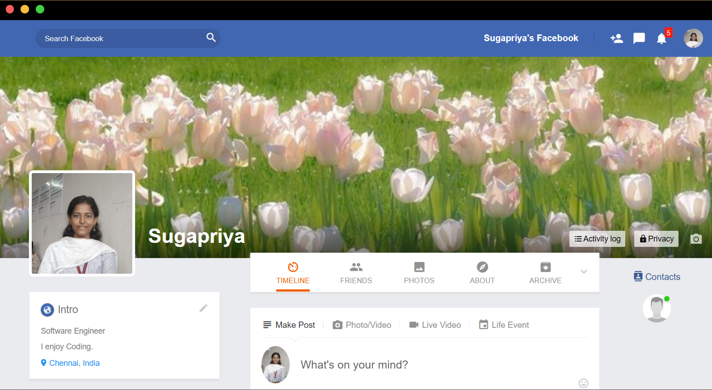
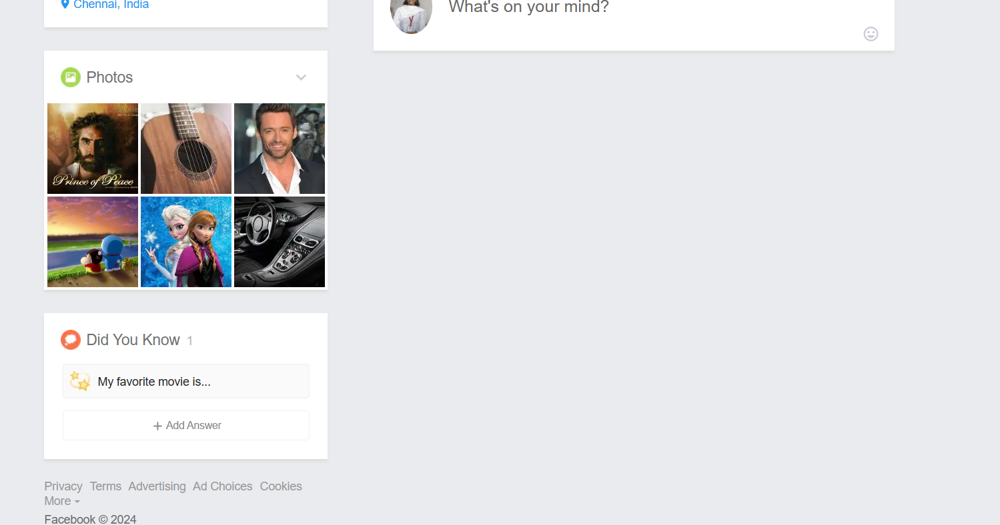

### FacebookClone-Frontend
 
A simple Facebook clone built using HTML, CSS, JavaScript, and Material Icons. This project is designed to replicate the core layout and features of Facebook, including a profile page, news feed, and user interaction features.

## Features

- **Responsive Layout**: The design adapts to various screen sizes, making it mobile-friendly.
- **Profile Section**: Displays the user's profile information, including a banner image, profile picture, and introductory text.
- **Main Feed**: A timeline of posts, with options to create posts, add photos/videos, and interact with friends.
- **Navigation**: Easy-to-use navigation bar with links to the profile, messages, notifications, and settings.

## Screenshots

### Profile Page


### Home Feed


## Installation

To run this project locally:

1. Clone this repository:
   ```bash
   git clone https://github.com/sugapriya-k/FacebookClone-Frontend.git
2. Navigate to the project directory:
   ```bash
   cd FacebookClone-Frontend
3. Open the index.html file in your browser to view the project:
   open index.html

## Technologies Used
- HTML5: For structuring the content.
- CSS3: For styling and creating the layout.
- Material Icons: For using Material Design icons.

## Features to be Added
- Login/Signup: Implement authentication to allow users to create accounts and log in.
- Post Comments and Likes: Add functionality to like and comment on posts.
- Messaging System: Build a real-time messaging system.

## Acknowledgements
**Material Icons**: Google Material Icons
Inspired by Facebook's user interface design.
markdown